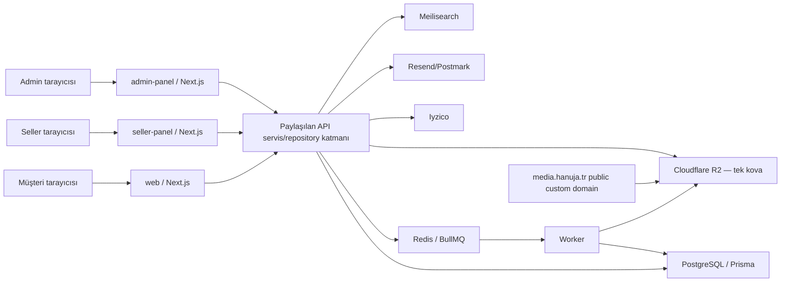

# Hanuja Tehdit Modeli

**Tarih:** 2026-08-03
**Kapsam:** İnternet-facing Hanuja storefront, seller/admin panelleri, paylaşılan API katmanı, PostgreSQL/Redis, BullMQ worker, R2 medya depolaması ve ödeme/e-posta/search entegrasyonları

## Sistem özeti

Hanuja; müşteri, seller ve admin rollerini üç ayrı Next.js uygulamasında sunan bir pazaryeridir. Uygulamalar aynı PostgreSQL verisini ve Better Auth secret'ını kullanır; paylaşılan servis/repository katmanı `api/` paketindedir. Background işler Redis/BullMQ worker'ında çalışır. Public ürün medyası ile return/dispute/support niteliğindeki kullanıcı yüklemeleri aynı R2 kova ve key uzayını paylaşır.

## Güven sınırları

1. **Anonim internet → uygulamalar:** tüm route, header, body, URL ve upload metadata saldırgan kontrollüdür.
2. **Kimliği doğrulanmış kullanıcı → domain nesnesi:** session kimliği nesne sahipliği değildir; order/dispute/return/seller ilişkisi her serviste ayrıca kanıtlanmalıdır.
3. **Seller → müşteri PII:** seller meşru fulfillment katılımcısıdır fakat purpose limitation geçerlidir; account e-postası ve operasyonel teslimat verisi aynı kategori değildir.
4. **Admin tarayıcısı → finansal mutasyon:** admin session tek başına intent kanıtı değildir; CSRF ve yüksek riskli eylemlerde step-up gerekir.
5. **Uygulama → R2:** server credential tüm kovayı okuyabilir. Key bilinmesi yetki anlamına gelmemelidir.
6. **Public CDN → R2:** custom domain'e bağlanan tek kova, uygulama auth katmanını atlayan ayrı bir okuma yüzeyidir.
7. **Upload → worker:** doğrulanmış kullanıcı içeriği güvenilir değildir; byte boyutu, decode edilen piksel sayısı ve işlem süresi sınırlanmalıdır.
8. **Runtime → secret/config:** build-time validation runtime güven sınırı yerine geçmez; her auth process fail-fast doğrulama yapmalıdır.

## Kritik varlıklar

| Varlık | Güvenlik hedefi |
|---|---|
| Better Auth secret ve session'lar | Gizlilik, bütünlük, hızlı rotasyon/iptal |
| Rol ve seller/order üyelik ilişkileri | Her nesne erişiminde server-side doğruluk |
| Sipariş, sözleşme ve müşteri PII | Need-to-know ve amaçla sınırlı açıklama |
| Uyuşmazlık/return mesajları ve kanıt | Yalnız katılımcılar/admin; değişiklik bütünlüğü |
| Ödeme, refund, payout, penalty ve komisyon | Yetkili aktör, açık intent, idempotency, audit |
| R2 özel medya anahtarları ve nesneleri | Key sızsa dahi authorization olmadan erişilememesi |
| PostgreSQL, Redis ve worker kuyrukları | İnternet yüzeyinden doğrudan erişilememesi; kaynak sınırları |

## Saldırgan profilleri

- Anonim internet kullanıcısı.
- Geçerli customer hesabına sahip kötü niyetli kullanıcı.
- Geçerli/suspended seller hesabına sahip kötü niyetli veya ele geçirilmiş kullanıcı.
- Aynı-site sibling origin'de script çalıştırabilen saldırgan.
- Anahtar/URL sızıntısı elde etmiş kişi.
- Ele geçirilmiş üçüncü taraf veya CI/runtime secret erişimi olan aktör.

## Ana saldırı yolları

### TM-01 — Uyuşmazlık nesne kimliği ile yatay erişim

1. Saldırgan geçerli customer/seller session'ı alır.
2. Log, UI, başka bir sızıntı veya tahmin dışı keşif yoluyla dispute CUID'i öğrenir.
3. Route yalnız session varlığını doğrular; servis/repository katılımcılığı doğrulamaz.
4. Saldırgan özel thread'i okur veya açık thread'e mesaj ekler.

**Kontrol:** Tek merkezi `assertDisputeParticipant`; customerId veya order line seller.userId eşleşmesi; admin için ayrı projection; unauthorized ve missing için aynı 404; negatif authorization testleri.

**2026-08-03 durumu:** DB-scoped viewer sorguları ve participant/staff projection ayrımı uygulandı; read ve message-write negatif yetkilendirme testleri eklendi.

### TM-02 — Known-key private medya okuma

1. Saldırgan evidence/support URL'sinden veya başka bir disclosure'dan R2 key öğrenir.
2. Kimliksiz `/api/media/fetch` route'una managed görünen URL verir ya da `media.hanuja.tr/<key>` adresini doğrudan çağırır.
3. Uygulama server credential'ı veya public custom domain nesneyi döndürür.

**Kontrol:** Public/private prefix ayrımı; yabancı host ve path normalization; private erişimde asset ID → DB ilişki authorization → stream; custom domain'i public-prefix allowlist'li Worker/WAF arkasına alma; `r2.dev` erişimini kapatma; private response için `Cache-Control: private, no-store`.

**2026-08-03 durumu:** Uygulama proxy'si ve return/dispute/support tüketicileri düzeltildi. Cloudflare custom domain public bucket'a doğrudan bağlı kaldığı için altyapı kolu açıktır ve TM-02 tamamen kapalı sayılmaz.

### TM-03 — Bilinen auth secret ile session forgery

1. Runtime env eksik/atlanmış validation ile başlar.
2. Better Auth repo içindeki fallback secret'ı kullanır.
3. Saldırgan geçerli session/cookie materyali üretir ve yüksek rolü taklit eder.

**Kontrol:** Auth config import edilirken eksik/kısa/placeholder secret'ı reddet; production'da env-validation skip'i reddet; secret rotasyonu ve tüm session revocation runbook'u; secret değerini loglamayan startup telemetry.

**2026-08-03 durumu:** Fail-fast runtime helper ve production skip reddi uygulandı. Canlıda secret varlığı/uzunluğu doğrulandı; geçmiş kullanım/rotasyon kanıtı bulunmadığı için toplu session revocation yapılmadı.

### TM-04 — Aynı-site script ile admin mutasyonu

1. Saldırgan `www` veya `satici` sibling origin'de script execution kazanır.
2. Admin cookie kapsamı ve CORS/request şekli izin verirse admin API'ye credentialed request yollar.
3. Step-up'sız JSON route, CSRF token kontrolü olmadan penalty/platform setting/return state değiştirir.

**Kontrol:** Host-scoped cookie; CSRF double-submit header; route ve `csrfFetch` client'ı birlikte değiştirme; Origin/Content-Type doğrulaması; yüksek etkili işlemlerde step-up; CSP ve sibling origin takeover/XSS önleme.

**2026-08-03 durumu:** Dört step-up'sız admin mutasyonu ve seller ilk-parola route'u handler seviyesinde korundu; production-semantics entegrasyon testleri eklendi. `mark-received` akışı sıfır refund tutarlı mevcut iş kuralı hatası çözülmeden dönüştürülmedi ve açık envanterde tutuldu.

### TM-05 — Upload ile kaynak tüketimi

1. Kimliği doğrulanmış uploader presigned URL alır.
2. Uygulama content length'i imzaya veya confirm'e bağlamadığı için büyük veya decode bombası niteliğinde nesne yükler.
3. Confirm/web veya concurrency=3 worker tam nesneyi belleğe alır; Sharp yüksek RAM/CPU tüketir.

**Kontrol:** Folder bazlı maksimum byte; confirm öncesi HEAD ve aşanı sil/reject; bounded read; Sharp pixel/input limitleri; owner/folder quota ve rate limit; worker concurrency/backpressure; metrics ve alarm.

**2026-08-03 durumu:** HEAD metadata doğrulaması, 10/20 MiB byte limitleri, bounded R2/external stream, 15 saniye external timeout ve 36 milyon Sharp input-pixel limiti uygulandı. Presigned URL tekrar kullanımı penceresi, cleanup retry, owner/folder kota, queue backpressure ve alarm maddeleri residualdır.

## Risk matrisi

| Tehdit | Olasılık | Etki | Öncelik | Kanıt |
|---|---|---|---|---|
| TM-01 dispute IDOR | Orta | Yüksek | High | `apps/web/src/app/api/disputes/[id]`, `api/services/dispute.service.ts`, `api/repositories/dispute.repository.ts` |
| TM-02 private medya | Orta | Yüksek | High | `api/routes/media.ts:fetchPublicMedia`, `api/lib/media-url.ts`, canlı `media.hanuja.tr` |
| TM-03 auth fallback | Düşük/Belirsiz | Kritik | Koşullu Critical | üç `apps/*/src/lib/auth.ts`, `packages/config/src/env.ts` |
| TM-04 admin CSRF chain | Düşük-Orta | Yüksek | High/Medium | `api/lib/csrf-check.ts`, step-up'sız admin mutasyon route'ları |
| TM-05 upload DoS | Orta | Yüksek | High | `api/lib/r2.ts`, `api/services/media.service.ts`, `api/jobs/media-processing.job.ts` |
| Seller e-posta disclosure | Yüksek (normal akış) | Orta | Medium | `api/services/order-document.service.ts`, seller detail/download |
| Middleware shadowing | Yüksek (deterministik) | Orta-Yüksek | High | `apps/*/middleware.ts` ve `apps/*/src/middleware.ts`; canlı header gözlemi |

## Mevcut güçlü kontroller

- Better Auth session ve server-side panel layout kontrolleri vardır.
- Seller order sorguları seller/order line ilişkisiyle filtrelenir.
- Finansal işlemlerin önemli bir alt kümesi tek kullanımlık step-up grant ister.
- R2 key'leri server-side UUID ile oluşturulur; kullanıcı filename'i key olarak kullanılmaz.
- KYC belgeleri public R2 yerine AES-256-GCM ile private persistent storage'da tutulur.
- Iyzico ödeme bağlama, tutar ve provider ID kontrolleri için ayrı güvenlik katmanları bulunur.

## Varsayımlar ve doğrulanması gerekenler

- Seller contract buyer e-postası maskelenir; teslimat ad/adres/telefonu fulfillment amacıyla açık kalır.
- Üç panel public internete açıktır; Better Auth cookie'lerinin `Domain` niteliği henüz canlı session üzerinden doğrulanmamıştır.
- Coolify'da secret değerleri açılmadan yapılan kontrolde dört serviste 64 karakterlik `BETTER_AUTH_SECRET`, 35 karakterlik `TURNSTILE_SECRET_KEY` vardır ve `SKIP_ENV_VALIDATION` tanımlı değildir. Değerlerin birbirine eşitliği veya geçmiş rotasyon durumu okunmamıştır.
- `media.hanuja.tr` public custom domain davranışı doğrulanmıştır; Cloudflare WAF/Access/Worker path kuralları olmadığı response davranışından çıkarımdır ve dashboard'da teyit edilmelidir.
- Her private media key'i UUID içerir; toplu listeleme bulunmadığı için saldırı pratikte key disclosure zincirine ihtiyaç duyar.

## Güvenlik test stratejisi

1. Authorization testlerinde her allow senaryosuna karşı customer/seller çapraz negatif senaryoları bulunmalı.
2. Media testleri yabancı host, encoded traversal, double slash, private/public prefix ve cache header'larını kapsamalı.
3. Secret testleri module initialization davranışını eksik, kısa, placeholder ve geçerli değerlerle doğrulamalı.
4. CSRF testleri `CSRF_STRICT=true` ile headersız 403 ve headerlı başarıyı çalıştırmalı; yalnız source-text araması yeterli sayılmamalı.
5. Upload testleri ilan edilen limite eşit, bir byte üstü, eksik ContentLength ve aşırı piksel metadata senaryolarını kapsamalı.
6. Build sonrası gerçek `middleware-manifest.json` aktif `src/middleware` bundle'ını ve matcher'ları doğrulamalı.

## İnceleme tetikleyicileri

Bu model; yeni auth provider/role, yeni public hostname, ikinci R2 bucket, media delivery Worker'ı, cookie domain değişikliği, yeni finansal mutasyon veya user-controlled dosya parser eklendiğinde güncellenmelidir.
