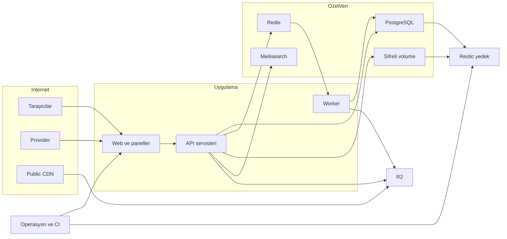

# Hanuja yerel tehdit modeli — 2026-10-01

## Executive summary

En yüksek riskler kullanıcı/satıcı sınırının aşılması, finansal admin işlemlerinin kurban oturumuyla tetiklenmesi, yayımlanan içerikten script çalıştırılması ve uygulama dışındaki medya erişim sınırıdır. İlk üç alanda doğrulanan yeni açıklar yerelde düzeltildi. Public R2 custom domain, runtime secret'lar, gerçek DB kilitleri ve kurtarma kapasitesi canlı kanıt olmadan güvenli sayılamaz. Bu model [raporla](rapor.md) birlikte okunmalı; yapılan düzeltmeler canlıya uygulanmadı.

## Scope and assumptions

- Kullanıcının onayladığı bağlam: Hanuja'nın üç web uygulaması, ortak API/DB, çok satıcılı siparişler, KYC ve özel belgeler, havale/EFT satışları; kart satışı kapalıdır. Bu onay ve yerel çalışma sınırı mevcut bağlam kabulüdür.
- Kapsam: `apps/{web,seller-panel,admin-panel}`, `api/`, `packages/{security,seo,config}`, Prisma şeması, production Compose, backup/restore/IR belgeleri ve testler. Runtime ile build/CI/ops birbirinden ayrılır.
- Kapsam dışı: harici tarama, Cloud servisi, paket/advisory indirme, gerçek müşteri verisi, canlı nesne okuma, provider/banka işlemi, push/deploy. Secrets değerleri ve Git geçmişinin tamamı denetlenmedi.
- Varsayım: UI ve API internet-facing; DB/Redis/search özel servis ağında. Bu, Compose dokümanıyla uyumlu fakat gerçek firewall kanıtı yoktur. Reverse proxy'nin Origin/forwarded IP davranışı da bilinmiyor.
- Sıralamayı değiştirecek açık sorular: R2 hâlâ private prefix'leri yayımlıyor mu; private anahtarlar/cache daha önce sızdı mı; çok instance/Redis kesintisi var mı; legacy iadeler kaç satıcıyı içeriyor; trusted-device ihtiyacı nedir; son tam kurtarma/alarm kanıtı ne zaman üretildi? Bu görev harici erişim sınırı nedeniyle bunları cevaplamaz.

## System model

### Primary components

Üç Next.js 15.5.22/React uygulaması kendi Better Auth konfigürasyonunu kullanır, ortak Prisma/PostgreSQL verisine erişir. `api/` servisleri finans, sahiplik ve bildirim işlemlerini taşır; BullMQ/Redis worker iş yürütür. KYC dosyaları AES-256-GCM ile özel volume'da; diğer medya R2'dedir. Meilisearch public katalog aramasını, Resend/Postmark mail akışını sağlar. Iyzico eski kart/refund kodu bulunur, yeni kart satışı kapalıdır. Kaynak: app `package.json`/`src/lib/auth.ts`, `api/worker.ts`, `api/lib/private-document-storage.ts`, `api/lib/r2.ts`, `api/lib/payment-capabilities.ts`.

### Data flows and trust boundaries

- **Tarayıcı → web/paneller (TB-1):** HTTPS üzerinden cookie, Origin, JSON/form ve dosya metadata'sı. Runtime session/role, yeni same-origin mutasyon sınırı, handler CSRF ve Zod kontrolleri. Proxy TLS ve gerçek origin doğrulanmadı.
- **Session → nesne/finans servisleri (TB-2):** Yerel çağrılarda user/seller/order kimlikleri, para ve IBAN. Session kimliği nesne yetkisi sayılmaz; repository query/projection, `participant-scope`, server amount, ödeme/refund/payout claim/lock/snapshot kullanılır.
- **Uygulama → DB/Redis/search (TB-3):** PostgreSQL/Redis/HTTP protokollerinde PII, oturumlar, kuyruk ve katalog. Parametreli sorgular ve private network tasarımı vardır; canlı TLS, role, firewall, keys bilinmiyor. Search public DTO'nun sınırında kalmalıdır.
- **Upload → storage/worker (TB-4):** HTTP presign, object bytes ve queue metadata. Sunucu key üretimi, sahiplik, confirm/read byte limitleri, mime/decode/pixel sınırları vardır. KYC volume dosyasında GCM, AAD ve key path kontrolü; R2 CDN access ayrı sınırdır.
- **CDN → R2 (TB-5):** URL/key üzerinden HTTP nesne okuma. Uygulama session filtreleri bu yolu korumaz; eski rapordaki public bucket bağlantısının güncel kapanma kanıtı yoktur.
- **Provider → callback/inbound (TB-6):** HTTP raw webhook body, imza/Basic Auth, ödeme ref ve mail ekleri. Resend imza/time kontrolü, Postmark credential ve kart kapatma guard'ı; eski kart kodunda provider backend retrieval ve order/amount binding. Provider hesabı/live sözleşme bilinmiyor.
- **Operatör/CI → runtime/yedek (TB-7):** Git/image/env/DB dump/şifreli belge arşivi. Secrets fail-fast, şifreli Restic tasarımı, yeni boş drill DB guard'ı vardır. Branch/release onayı, image pin, key kurtarma, gerçek backup ve alarm teslimi canlı doğrulanmadı. Local commit hook'u otomatik push içerebilir; bu görevde komut bazında kapatılır.

#### Diagram

## Assets and security objectives

| Asset | Why it matters | Security objective (C/I/A) |
|---|---|---|
| Session, MFA, auth secret, OTP | Hesap/rol ve finans işlemi yetkisi | C/I; hızlı iptal |
| Müşteri/satıcı PII, KYC, sözleşme | Kimlik ve ticari mahremiyet | C/I; amaçla sınırlı erişim |
| İade/uyuşmazlık mesaj ve kanıtları | Satıcılar arası gizlilik ve karar bütünlüğü | C/I |
| Ödeme/refund/payout/IBAN/ledger | Para yönlendirme ve muhasebe doğruluğu | I/A; idempotency |
| Medya key'leri ve ciphertext/key çifti | URL bilgisi okuma yetkisi olmamalı | C/I; ayrı key yönetimi |
| DB/queue/search/compute | Süreklilik ve yayımlanmamış veri ayrımı | C/I/A |
| Audit log, backup ve build artifact | İnceleme, kurtarma ve güvenilir release | I/A; sınırlı C |

## Attacker model

### Capabilities

Anonim kullanıcı route/header/body/URL gönderebilir. Kötü niyetli veya ele geçirilmiş customer/seller kendi hesabıyla ürün/metin/dosya yazabilir, nesne kimliği öğrenebilir ve eşzamanlı istek gönderebilir. Sibling domain ele geçirme veya kurbanın yayımlanmış sayfayı ziyaret etmesi CSRF/XSS senaryosudur. Bir URL/key veya DB salt-okuma erişimi elde edilmesi ayrı ve açık önkoşuldur. Yetkili operatörün yanlış URL ile restore yapması ayrı operasyonel tehdit kaynağıdır.

### Non-capabilities

Anonim aktöre admin session, server shell, DB erişimi, private encryption key veya provider secret verilmez. Satıcının başka siparişlerde otomatik üyeliği yoktur. Bilinmeyen CUID'lerin tahmin edilebildiği, canlı public DB portu bulunduğu veya 503 kart endpoint'inin ödeme onaylayabildiği varsayılmaz. HttpOnly session'ı doğrudan JS ile okumak XSS etkisinin şartı değildir.

## Entry points and attack surfaces

| Surface | How reached | Trust boundary | Notes | Evidence (repo path / symbol) |
|---|---|---|---|---|
| Auth/session/MFA/reset | Üç app auth API | TB-1/2 | Gerçek app config, factory config'i tek başına kanıt değil | `apps/*/src/lib/auth.ts`, `auth-security.ts` |
| Admin finans ve banka | Cookie'li JSON/form POST/PATCH/DELETE | TB-1/2 | Origin, CSRF, role ve step-up gereken yollar | `api-origin-boundary.test.ts`, admin `api/admin` |
| Sipariş/iade/dispute/CSV | Auth API ve belge UI | TB-2 | Tenant ID ve projection kritik | `participant-scope.ts`, `dispute.repository.ts` |
| Ürün/SEO/blog HTML | Seller içerik girdisi ve public sayfa | TB-1/2 | JSON-LD HTML parser sınırı | `packages/seo/src/json-ld.tsx`, `sanitize-blog-html.ts` |
| Public/private medya ve KYC | Proxy, asset ID, presign/confirm | TB-4/5 | CDN private handler'ı bypass edebilir | `api/routes/media.ts`, `r2.ts`, `private-document-storage.ts` |
| Iyzico/Resend/Postmark | İnternet provider POST | TB-6 | Kart satış uçları kapalı, mail auth aktif | web `api/payment`, `api/webhooks`, `api/inbound` |
| Worker/job | Redis kuyruğu ve tekrarlı job | TB-3/4 | Kaynak sınırı, idempotency/outbox | `api/worker.ts`, `api/jobs` |
| DB/cache/search/log | App yetkisi veya yanlış ağ config | TB-3 | Public DTO/cache ve credential scope | `docker-compose.production.yml`, `rate-limit-redis.ts` |
| Build/backup/restore | Privileged CI/ops komutu | TB-7 | Runtime saldırısı değil; tedarik/kurtarma sınırı | `pnpm-lock.yaml`, `.githooks/post-commit`, `tools/ops` |

## Top abuse paths

1. Diğer satıcının kanıtını alma → çok satıcılı siparişe meşru üyelik → A'ya atanmış iade/dispute/asset ID'yi B session'ıyla çağırma → eski geniş order katılımı nedeniyle veri ifşası. Yeni kapsam ve 404 engeli yerelde doğrulandı.
2. Uygulamayı atlayarak private dosya alma → URL/key öğrenme → public CDN üzerinden R2 nesnesini okuma → session filtrelerini bypass. Güncel canlı durum doğrulanamadı.
3. Para yönlendirme → admin'i sibling origin'e yönlendirme → cookie taşıyan banka hesabı mutasyonu → alıcı IBAN değiştirme. Origin+token sınırı yerelde doğrulandı.
4. Kurban adına işlem → seller kontrollü ürün metnine script kapanışı ekleme → kurban ürün sayfasını açar → storefront origin'inde JS çalışır. JSON-LD escape yerelde doğrulandı.
5. IBAN step-up'ını tekrar kullanma → session/kod veya DB salt-okuma erişimi → tek kodla iki eşzamanlı banka talebi → step-up'ın tekrar kullanılması. HMAC ve atomik tüketim eklendi; activation gate ayrıca korunur.
6. Fazla/iç içe ödeme-iade → bozuk provider amount/ref veya eşzamanlı EFT/refund/payout isteği → compare-and-swap/lock/cap atlama girişimi → çifte ödeme ya da yanlış ledger. Mevcut service testleri geçti; gerçek DB/provider koşulu açık.
7. Hizmeti durdurma → yüksek boyut/decode maliyetli upload veya çok istek → worker/app/Redis kapasitesini tüketme → operasyon kesintisi. Byte/decode/hız kontrolleri var; dağıtık fallback ve canlı kaynak sınırları açık.
8. Veriyi kaybetme veya güvenilir olmayan release → yanlış restore DB'si, kayıp key, kötü bağımlılık/build → DB silme/restore başarısızlığı veya kod bütünlüğünün bozulması → veri/süreklilik kaybı. Restore guard yerelde sınandı; gerçek kurtarma/advisory/CI kanıtı yok.

## Threat model table

Öncelik, saldırı önkoşulu gerçekleşirse kalan **canlı risk temasını** ifade eder; yerel fix'in deploy edildiğini göstermez. Eski modeldeki TM-01…TM-05 burada TM-001…TM-005 olarak karşılanır; yeni tehditler TM-006'dan başlar.

| Threat ID | Threat source | Prerequisites | Threat action | Impact | Impacted assets | Existing controls (evidence) | Gaps | Recommended mitigations | Detection ideas | Likelihood | Impact severity | Priority |
|---|---|---|---|---|---|---|---|---|---|---|---|---|
| TM-001 | Satıcı/customer | İlgili sipariş ve hedef ID | Yanlış tenant'a ait kanıt/mesaj erişimi | Mahremiyet ihlali | İade/dispute/PII | `participant-scope`, dar DTO, AUD-003 | Deploy ve legacy backfill yok | İlgili seller kapsamını canlıda uygula; legacy politika belirle | Tenant dışı 404 artışı, belge erişim audit'i | medium: üyelik/ID gerekir | high: hassas belge | high |
| TM-002 | URL/key bilen aktör | Private key ve public bucket yolu | CDN ile handler bypass | Dosya ifşası | Özel medya | Public prefix proxy, no-store, AUD-003 | Eski public bucket sınırı güncel doğrulanmadı | Ayrı private bucket/auth gateway; eski URL/cache kapat | Private prefix anonymous okuma alarmı | medium: bilinen key şartı | high: auth dışı ifşa | high |
| TM-003 | Ağ/secret erişimi olan aktör | Eksik/yanlış config veya secret sızıntısı | Bilinen parola/secret ile veri veya hesap erişimi | Toplu veri/rol kaybı | DB/session/keys | `requireRuntimeSecret`, Compose zorunlu parola, AUD-006 | Canlı keys/TLS/firewall yok | Least privilege, güçlü ayrı keys, rotation ve private network kanıtı | Secret kullanım/ağ erişim sapması | low: ikinci erişim veya config hatası gerekir | high: toplu veri; auth forgery kritik olabilir | high |
| TM-004 | Sibling origin saldırganı | Kurban oturumu ve tarayıcı isteği | Admin/seller mutasyonu tetikleme | Finansal bütünlük kaybı | Platform IBAN/payout | Origin/token/role, AUD-002 | Canlı matcher/canonical origin ve E2E yok | Origin doğru konfigüre; handler token/step-up sürdür | Kaynak 403, yüksek etkili audit eylemleri | medium: sibling/kurban şartı | high: para yönlendirme | high |
| TM-005 | Uploader/istek gönderen | Auth upload veya yoğun public istek | Byte/decode/queue yüküyle tüketim | Kesinti | Worker/app/Redis | `r2.ts`, media bounds testleri | Canlı quotas/CPU ve Redis fallback | Kuyruk ve kaynak limitleri; yüksek risk rate gate | Queue lag, rejected byte, Redis fallback alarmı | medium: kontrollü kapasite aşımı gerekir | medium: hedefli kesinti | medium |
| TM-006 | Seller içerik yazarı | Yayımlanmış metin ve ziyaretçi | Script etiketinden çıkıp JS çalıştırma | Veri okuma/kurban adına işlem | Session'lı storefront | JSON-LD escape, AUD-001; blog allowlist | Deploy yok, tam script CSP yok | Escape'i uygula; CSP ve diğer sink'leri incele | İçerikte script kapanışı/sanitize reddi | medium: yayın/ziyaret gerekir | high: origin yetkisi | high |
| TM-007 | Session/OTP hırsızı | Session+kod veya DB okuma | Kısa kod ifşası/tekrar kullanımı | Step-up zayıflığı | IBAN değişiklik talebi | HMAC claim/role/24h/admin, AUD-004 | İşlem içeriğine bağlı kod yok; mail/trust cihaz riski | Tek kullanım uygula; yüksek riskte yeni MFA ve değişiklik bildirimi | İki claim, sık OTP/IBAN değişimi | low: oturum/kod ve activation gate gerekir | medium: ek activation kontrolü var | medium |
| TM-008 | Finans suistimalcisi | Yetkili finans isteği veya provider ref | Tutar/ref/yarış ile çifte kayıt | Para ve ledger kaybı | Payment/refund/payout | `payment.service`, refund caps, payout locks/snapshot; kart kapalı | Gerçek PostgreSQL/provider testi yok | Disposable DB yarış testi; eski kart satışını yeniden açmadan review | Mismatch event, transfer ref, reconciliation | low: gate/lock/cap var | high: finansal kayıp | high |
| TM-009 | Operatör hatası/backup ihlali | Yetkili restore veya key kaybı | Yanlış DB restore/key kurtarmama | Veri kaybı/kesinti | DB/ciphertext/backup | Restic script, yeni guard, AUD-007 | Gerçek restore/decrypt/alarm yok | Dedicated boş DB, backup check, decrypt+app smoke tatbikatı | Failed timer/restore ve kaçırılmış backup alarmı | low: privileged operasyon gerekir | high: kurtarma kaybı | medium |
| TM-010 | Tedarik/CI aktörü | Bağımlılık veya release erişimi | Güvensiz kod/config yayımlama | Bütünlük/secret kaybı | Build/runtime | Lockfile/pin ve yerel lint/typecheck/build | Güncel advisories, CI erişim/image pin yok | Yetkili ayrı işte CVE/CI review; SBOM'u yerel tut | Release hash/dependency değişimi | low: tedarik/CI erişimi varsayımı | high: tüm runtime etkisi | medium |

## Criticality calibration

- **critical:** Anonim toplu KYC/DB ifşası veya production RCE; gerçek auth secret fallback'i ile admin session forgery. Bu iki sınıfta yeni doğrulanmış açık bulunmadı.
- **high:** Satıcılar arasında hassas iade/kanıt erişimi; platform IBAN CSRF veya yayımlanan üründe oturumlu origin XSS. AUD-001/002/003 bu sınıftadır.
- **medium:** Activation gate'i bulunan banka OTP tekrar kullanımı; privileged restore hatası veya dağıtık rate limit'in kesintide zayıflaması. Ek şartlar ağırdır, yine de süreç etkisi vardır.
- **low:** Kapalı endpoint'in dormant malformed-signature exception'ı; hassas olmayan ve operasyonel etkisi sınırlı hata mesajı. Sadece regex adayı bir bulgu değildir.

## Focus paths for security review

| Path | Why it matters | Related Threat IDs |
|---|---|---|
| `api/lib/participant-scope.ts`, `api/repositories/dispute.repository.ts` | Role/seller/return sınırı ve legacy davranış | TM-001 |
| `api/routes/media.ts`, `api/lib/media-url.ts` | Public/private okuma ve arbitrary URL sınırı | TM-001/002/005 |
| `api/lib/r2.ts`, `api/jobs/media-processing.job.ts` | Byte/decode/pixel limitleri ve R2 namespace | TM-002/005 |
| `api/lib/private-document-storage.ts` | GCM/key/path/permission garantisi | TM-002/003/009 |
| `apps/*/src/middleware.ts`, `packages/security/src/request-origin.ts` | Tam route matcher ve mutasyon origin sınırı | TM-004 |
| admin `api/admin/bank-accounts`, bank-accounts form | Handler token ve client eşleşmesi | TM-004 |
| `packages/seo/src/json-ld.tsx`, `api/lib/sanitize-blog-html.ts` | HTML parser ve kullanıcı metni sink'leri | TM-006 |
| seller `api/seller/bank-details`, `api/lib/seller-bank-otp.ts` | OTP store/claim ve rol | TM-007 |
| `api/services/seller-bank.service.ts` | 24h/admin activation ve notifications | TM-007/008 |
| `api/services/payment.service.ts`, `refund-execution.service.ts`, `payout.service.ts` | Amount/ref/cap/claim/lock/snapshot | TM-008 |
| web `api/webhooks`, `api/inbound`, `api/payment` | İmza/credential ve kapalı kart uçları | TM-004/008 |
| `apps/*/src/lib/auth.ts`, `api/lib/auth-security.ts` | Gerçek app session/MFA/trust revoke | TM-003/007 |
| `api/lib/rate-limit-redis.ts`, `docker-compose.production.yml` | Dağıtık rate fallback ve private ağ varsayımı | TM-003/005 |
| `tools/ops`, `docs/05-security/incident-response.md` | Geri yükleme ve alarm pratiği | TM-009 |
| `pnpm-lock.yaml`, `patches/next@15.5.22.patch`, `.githooks/post-commit` | Advisory/CI bağımlılığı ve otomatik push | TM-010 |

## Notes on use

Keşfedilen route envanteri, auth, upload/provider, worker, storage/CDN ve ops/CI girişleri modellendi; her TB-1…TB-7 bir tehditte temsil edildi. Runtime ve CI/ops ayrıldı. Kullanıcı planındaki yerel sınır, kart kapatma ve multi-tenant bağlam korundu; canlı durumlar açık varsayım olarak kaldı. Model regresyon/test odağıdır; penetrasyon testi, canlı yapılandırma sertifikası veya gerçek DB eşzamanlılık kanıtı değildir. Priority'yi düşürmek için deploy, provider/DB ve özellikle CDN sınırı kanıtı gerekir.
